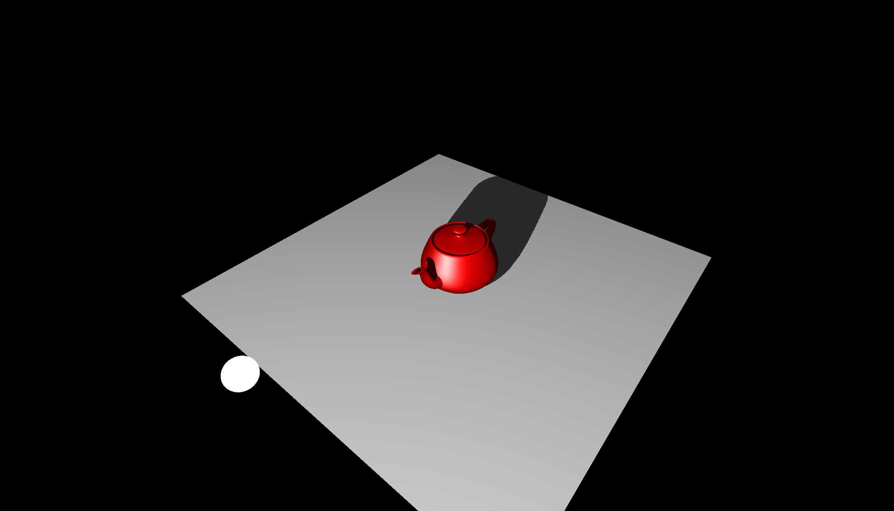

Project 7

Rendering of the teapot and plane with shadows on plane and teapot

In addition to the previous projects

1. Load the object mesh for the light source
2. Add a new simple vertex and fragment shader for generating the depth buffer of the teapot from the light source.
3. In the main render loop
  1. Setup a render-to-texture for the depth buffer using GLRenderDepth2D
  2. Initialize it using depth comparison texture, the resolution of the shadow map and bilinear filering
  3. Enabling face culling and culling front facing triangles
  4. Render the teapot into the depth buffer from the view of the light source
  5. Disable face culling
  6. Convert the Light view MVP to the shadow MVP and pass it to the teapot vertex shader for both the teapot and the plance.
  7. Transform the model-space vertices to shadow coordinates from the light view.
  8. Compare the shadow coordinates depth value with the depth value sampled from the shadow map using sampler2DShadow.
  9. Apply shadow if shadow coordinates depth value greater the shadow map depth value.
  10. Draw light source at the coordinates of the light source

https://user-images.githubusercontent.com/16291248/211943285-cbbfbde8-939e-446c-b05b-560f0eb09c00.mp4

How to use your implementation

1. Compile the texture.cpp file, cyCodeBase must be present in the include path

clang++ -std=c++11 -stdlib=libc++ ShadowMapping.cpp lodepng.cpp -o ShadowMapping -lglfw -lglew -framework OpenGL -I/Users/u1316087/Downloads/homebrew/include/ -L/Users/u1316087/Downloads/homebrew/lib'

1. Run the executable

./ShadowMapping teapot2.obj

1. Controls

The mouse left button with CNTRL enables rotating the light source in world space.

The mouse left/right button with OPTION/ALT pressed controls the plane

The mouse left/right button pressed controls the object.

What operating system and compiler you used
 Operating System: macOS 11.3 Big Sur

GLFW version: 3.3.6 GLEW version: 2.2.0\_1

Compiler:
 Apple clang version 12.0.5 (clang-1205.0.22.11) Target: x86\_64-apple-darwin20.4.0

External libraries and additional requirements to compile the project.

cyCodeBase, GLFW and GLEW are required
